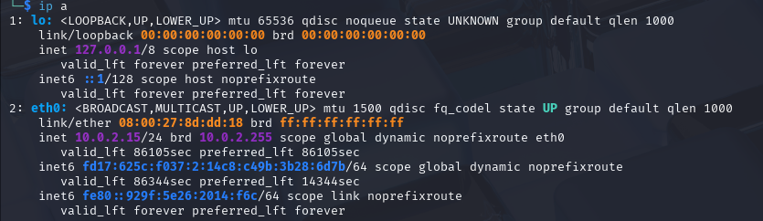
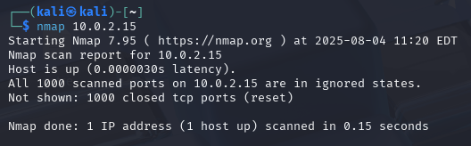
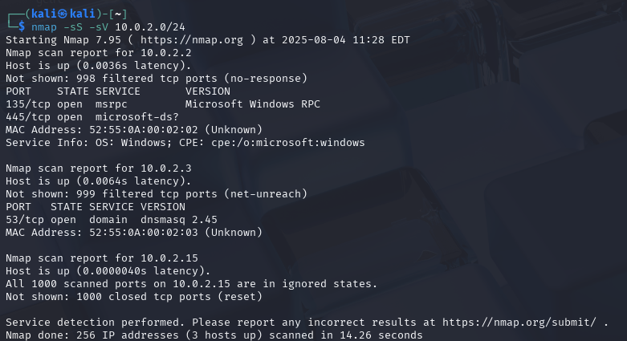
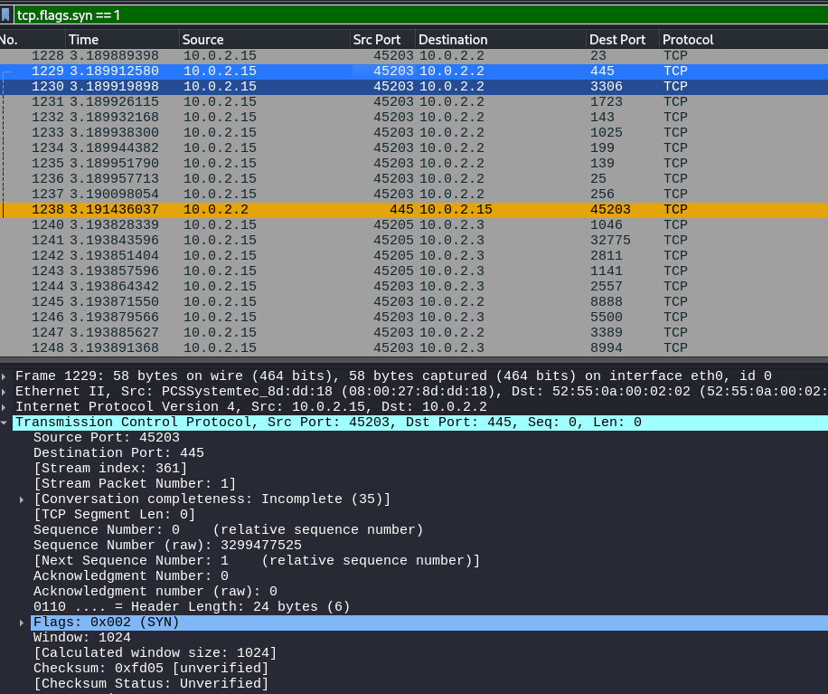
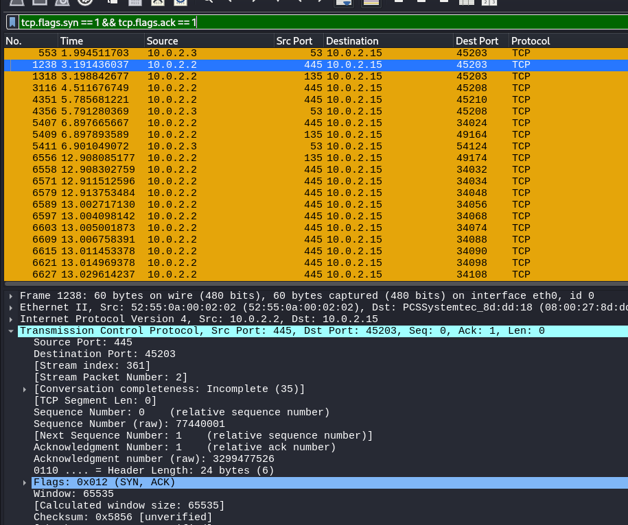
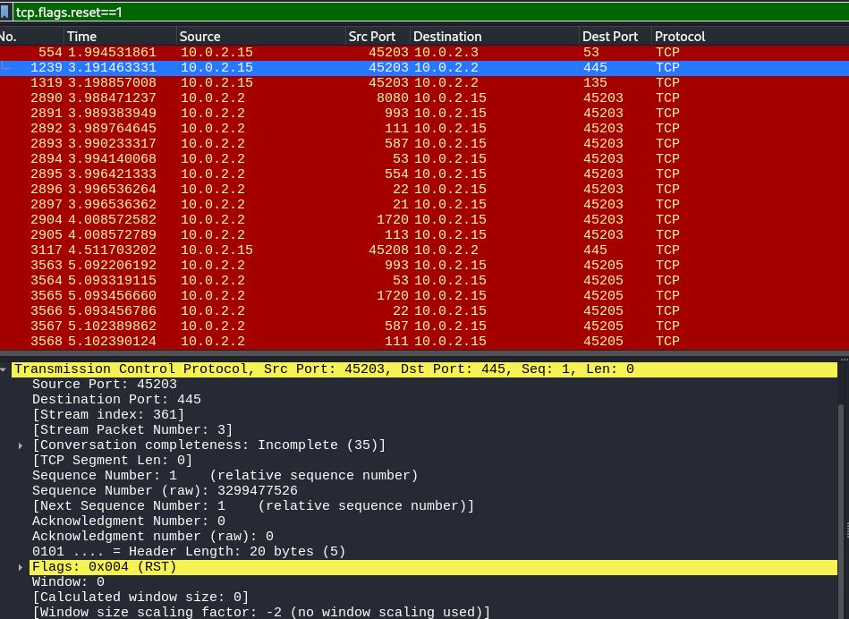

# Internship-Elevatelabs-task1

## Task 1: Scan Your Local Network for Open Ports

### Objective: 
Learn to discover open ports on devices in your local network to understand network exposure.
### Tools: 
Nmap (free), Wireshark (optional).

### Step 1:-Start the Virtual machine linux 
open the terminal
### Step 2:- find the local ip address 
Use command ifconfig

#### IP Address Info:
•	Interface: eth0

•	IP Address: 10.0.2.15

•	Netmask: 255.255.255.0

•	Broadcast Address: 10.0.2.255

Now use ip a command

#### IP Range:
• subnet: 10.0.2.0/24

•	Network range: 10.0.2.1 to 10.0.2.254

•	Subnet mask: /24 (or 255.255.255.0)

•	Broadcast address: 10.0.2.255

### Step 3:- Start nmap first scanned own ip.

### Step 4:- Scan ip address for subnet 10.0.2.0/24 total 256 ip address

We get information that on 2 ip address open ports are present.

1)	10.0.2.2

On this ip two ports are opened 135 and 445 on windows.

2)	10.0.2.3
   
On this ip one port is opened Port 53.

##### a)	Port 135 (MSRPC)

Service: Microsoft Remote Procedure Call

Use: Enables Windows processes to communicate remotely

Common On: Windows systems

Security Risk: High — targeted in many worms and exploits (e.g., Blaster, WannaCry)

Recommendation: Block port 135 externally at firewalls; monitor for unusual traffic

It often works together with other ports, like:

•	139 (NetBIOS)

•	445 (SMB)

•	High dynamic ports (e.g., 49152–65535)

##### b)	Port 445 (Microsoft-DS)

Service: SMB(Server Message Block) protocol over TCP

Used for: File sharing, printer access, Active Directory communication

Common on: Windows systems

Security Risk: Very high — exploited by major malware (e.g., WannaCry, EternalBlue)

Recommendation: Block on public-facing interfaces, restrict on internal networks, and disable SMBv1

##### c)	Port 53 (dnsmasq)

Service: DNS (using dnsmasq)

Protocol: TCP (used for large DNS responses or zone transfers)

Purpose: Handles DNS queries and optionally DHCP

Security Risk: May be vulnerable to spoofing, DNS tunneling, and past CVEs

Recommendation: Restrict to internal use, keep dnsmasq updated, and monitor for unusual DNS activity

### Step 4:- Start wireshark and then click on capture after that run nmap scan command again after nmap scan is completed stop the wireshark and save this as pcap file.

### Step 5:- open pcap file and fliter  tcp.flags.syn == 1

Observed SYN packets being sent to multiple IPs on various ports.

### Step 6:-  Apply filter tcp.flags.syn == 1 && tcp.flags.ack == 1

Received SYN-ACKs from open ports

### Step 7:- Apply filter tcp.flags.reset == 1

Received Reset response 

Scan and saved the nmap result in txt file along with pcap file for wireshark both of them are present in Output folder.
