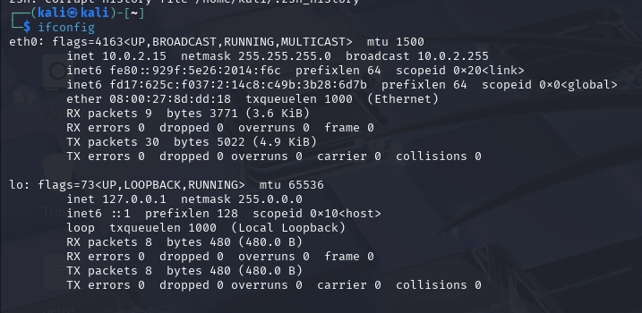

# Internship-Elevatelabs-task1

## Task 1: Scan Your Local Network for Open Ports

### Objective: 
Learn to discover open ports on devices in your local network to understand network exposure.
### Tools: 
Nmap (free), Wireshark (optional).

### Step 1:-Start the Virtual machine linux 
open the terminal
### Step 2:- find the local ip address 
Use command ifconfig

#### IP Address Info:
•	Interface: eth0

•	IP Address: 10.0.2.15

•	Netmask: 255.255.255.0

•	Broadcast Address: 10.0.2.255
